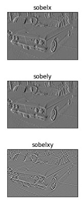
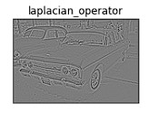
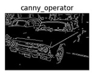

# EDGE DETECTION
# AIM:
To perform edge detection using Sobel, Laplacian, and Canny edge detectors.

# SOFTWARE REQUIRED:
Anaconda - Python 3.7

# ALGORITHM:
## STEP 1:
Import the necessary packages cv2 and matplolib.


## STEP 2:
Read the image as grayscale and reduce the noise using cv2.GaussianBlur.

## STEP 3:
Perform various methods of edge detection Sobel edge detector,Laplacian edge detector,Canny edge detector.

## STEP 4:
Run the program.

## STEP 5:
Execute the output.


 
# PROGRAM:
## Import the packages:
```
import cv2
import matplotlib.pyplot as plt
```


## Load the image, Convert to grayscale and remove noise:
```
image=cv2.imread('car.jpg')
gray=cv2.cvtColor(image,cv2.COLOR_BGR2GRAY)
gaus=cv2.GaussianBlur(gray,(3,3),0)
```


## SOBEL EDGE DETECTOR:
```
sobelx=cv2.Sobel(gaus,cv2.CV_64F,1,0,ksize=5)
sobely=cv2.Sobel(gaus,cv2.CV_64F,0,1,ksize=5)
sobelxy=cv2.Sobel(gaus,cv2.CV_64F,1,1,ksize=5)
plt.figure(1)
plt.subplot(2,2,1)
plt.imshow(gaus,cmap='gray')
plt.title('Original image')
plt.xticks([])
plt.yticks([])
plt.show()
```
## SOBEL X:
```
plt.subplot(2,2,1)
plt.imshow(sobelx,cmap='gray')
plt.title('Sobelx')
plt.xticks([])
plt.yticks([])
plt.show()
```
## SOBEL Y:
```
plt.subplot(2,2,1)
plt.imshow(sobely,cmap='gray')
plt.title('Sobely')
plt.xticks([])
plt.yticks([])
```
## SOBEL XY:
```
plt.subplot(2,2,1)
plt.imshow(sobelxy,cmap='gray')
plt.title('Sobelxy')
plt.xticks([])
plt.yticks([])
plt.show()
```


## LAPLACIAN EDGE DETECTOR:
```
laplacian = cv2.Laplacian(Image,cv2.CV_64F)
plt.figure(1)
plt.subplot(2,2,1),plt.imshow(laplacian,cmap = 'gray')
plt.title('laplacian_operator'), plt.xticks([]), plt.yticks([])
plt.show()
```


## CANNY EDGE DETECTOR:
```
canny_edges = cv2.Canny(Image, 120, 150)
plt.figure(1)
plt.subplot(2,2,1),plt.imshow(canny_edges,cmap = 'gray')
plt.title('canny_operator'), plt.xticks([]), plt.yticks([])
plt.show()
```


# OUTPUT:
## ORIGINAL IMAGE:

## IMAGE AFTER CONVERTING TO GRAYSCALE AND NOISE REMOVAL:

### SOBEL EDGE DETECTOR:



### LAPLACIAN EDGE DETECTOR:



### CANNY EDGE DETECTOR:


# RESULT:
Thus the edges are detected using Sobel, Laplacian, and Canny edge detectors.
